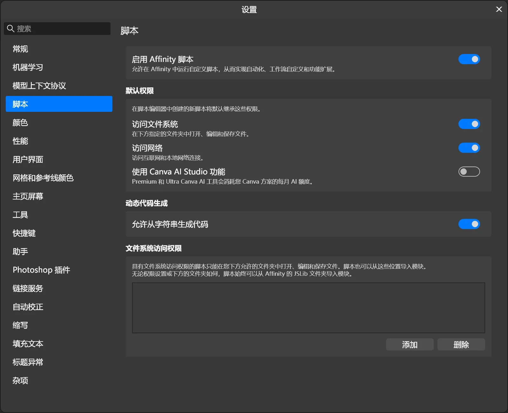
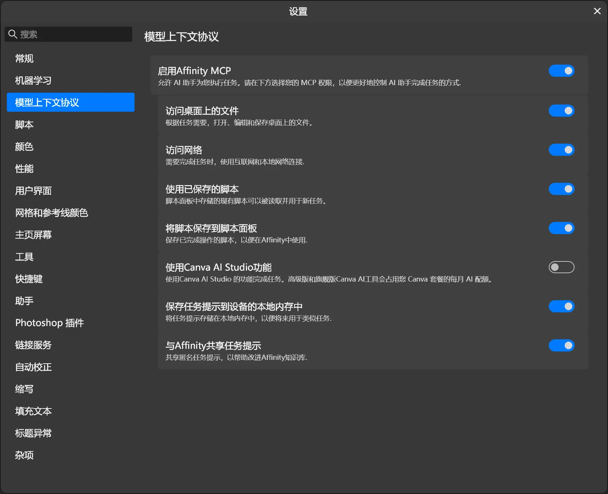
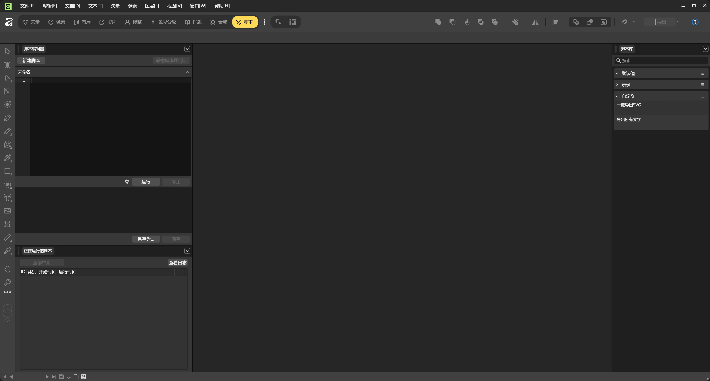

# Affinity-script 脚本编写 Skill

> 一套让 AI Agent 能可靠编写、调试、校验 Affinity 3.3+ 脚本的技能包。
> 沉淀自一次完整的 Affinity 脚本开发会话，包含**破译后的权限机制**、**逆向的容器格式**、
> **打通的 MCP 调试通道**，以及 **104 项离线测试**。

## 建议使用 Affinity 国际版（Canva 版）

国内版本虽然也更新到了 3.3 以上的版本，有脚本功能，但**没有 MCP 功能**，
没有办法让 Agent 实时操作 Affinity 测试修正，所以编写脚本时还是得依靠 Canva 版。

## 使用前置条件

### 1. 启用 Affinity 脚本功能



编辑 ▸ 设置 ▸ 脚本，把「允许脚本」打开。

### 2. 启用 Affinity MCP 功能



编辑 ▸ 设置 ▸ **MCP**，把 `EnableMCPServer` 设为 `True`
（读写脚本库还需 `EnableReadScripts` / `EnableWriteScripts`）。
建议用 SkillHub 技能托管的 MCP 通道，让 Agent 直接调试。

## 使用

按需要编写脚本后，可以让 Agent 直接调试，最后存到脚本库中。



## 安装

下载 `affinity-script-0.4.zip` 并解压到你的 skills 目录
（例如 `~/.agents/skills/affinity-script/`），重启 Agent 会话即可。

## 核心结论

| 结论 | 说明 |
|---|---|
| **API 权威资料在本机** | `C:\Program Files\Affinity\Affinity\Resources\JSLib\` 是明文 SDK 源码，版本与本机严格一致。**不要上网查** —— 官方文档站从 Agent 环境不可达，网上资料多为过时的 3.2 |
| **优先走 MCP 通道** | 能直接执行脚本拿 `console.log` 做真机调试；`save_script_to_library` 入库的脚本**权限位 = 3（完整）**，无需修权限 |
| **只交付 `.js` 源码** | `.afscript` 仅用于分享给别人 —— 导入后权限位 = 0，需修复 |
| **入口只有一种** | 顶层 `function main(){…}` + 末尾 `main();`。官方 preamble 明确要求**不要**用 `module.exports.main` |
| **权限是位掩码，不是路径** | 每脚本一条 `mreP` u64 LE 记录（bit0 = 文件系统，bit1 = 网络）；文件夹白名单是另一回事 |

## 包内内容

```
affinity script 0.1/
├── SKILL.md                          ← AI 读的主指令
├── run-tool.ps1 / run-tool.cmd      ← 稳定启动入口（推荐用这个）
├── reference/
│   ├── api-cheatsheet.md             ← 按任务查 API
│   ├── mcp-channel.md                ← MCP 协议细节 + 故障排查
│   ├── afscript-format.md            ← .afscript 容器格式逆向
│   ├── illustrator-migration.md      ← Illustrator 迁移对照表
│   └── verified-vs-inferred.md       ← 哪些是实测、哪些是推断
├── scripts/                          ← 工具链
├── tests/                            ← 104 项离线测试
└── assets/                           ← 可直接改的范本
```

## 环境要求

| 项 | 要求 |
|---|---|
| Affinity | **3.3+**（在 3.3.0.4850 / Windows 上实测；macOS 未验证） |
| Node.js | **18+**；`.afscript` 打包器需 **≥ 22.15.0**（推荐 24+） |
| MCP（可选但推荐） | `EnableMCPServer=True` |

SDK 装在别处时设环境变量 `$env:AFFINITY_JSLIB`。

## 快速上手

```powershell
# 验证脚本（语法 + SDK 符号 + 9 项已知陷阱）
.\affinity script 0.1\run-tool.ps1 validate .\我的脚本.js

# 打包成可分发的 .afscript（21 项自校验）
.\affinity script 0.1\run-tool.ps1 make-afscript .\我的脚本.js --title "标题"

# 修复导入脚本的权限（默认 dry-run，确认后加 --apply）
.\affinity script 0.1\run-tool.ps1 fix-script-perms --list

# MCP 通道
.\affinity script 0.1\run-tool.ps1 mcp-client --discover
.\affinity script 0.1\run-tool.ps1 mcp-client --exec-file .\我的脚本.js

# 跑离线测试（不需要装 Affinity）
.\affinity script 0.1\run-tool.ps1 tests
```

## 安全说明

`fix-script-perms.mjs` 会**直接改写你的脚本库文件**，请注意：

- **默认 dry-run**，必须显式加 `--apply` 才写文件
- 写前自动备份，写后重新读盘校验
- 请在**完全退出 Affinity 后**运行（运行中修改会被 Affinity 退出时覆盖）

## 免责声明

- `bit2（GenAI）` 权限位的含义是**推断**，未单独验证
- 真机未验证项清单见 `affinity script 0.1/reference/verified-vs-inferred.md`

## License

MIT